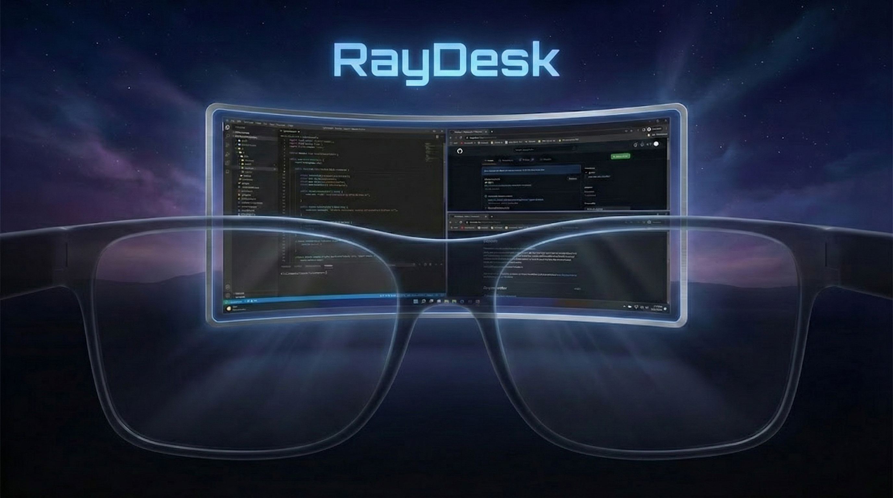
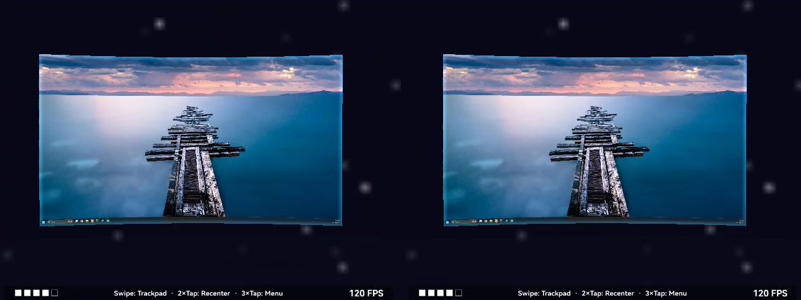

# RayDesk

Stream your PC desktop to your AR glasses.



## Features

- **Three display modes** -- Keyhole panning, floating monitor, or curved widescreen
- **Virtual environment** -- Immersive 3D space with customizable themes
- **Radial settings menu** -- Quick access to zoom, display mode, and theme settings
- **Multi-monitor switching** -- Switch between PC monitors from the menu
- **Temple gesture controls** -- Tap, swipe, and long-press on the glasses touchpad
- **Connection quality HUD** -- Live signal strength and FPS overlay

## Quick Start

### What You Need

1. **RayNeo X3 Pro** AR glasses with USB debugging enabled
2. **[Sunshine](https://github.com/LizardByte/Sunshine)** installed on your PC (streaming host)
3. Your **PC and glasses on the same WiFi network**
4. **ADB** on your computer ([download here](https://developer.android.com/tools/releases/platform-tools))

> Need help? Watch [Informal Tech's video on how to sideload apps on the X3 Pro](https://www.youtube.com/watch?v=l3wu7x14LKY).

### Install

1. Download **RayDesk-v1.0.0.apk** from the [Releases](https://github.com/Quad-Labs/RayDesk/releases) page
2. Connect your glasses to your PC via USB
3. Install the APK:
   ```bash
   adb install RayDesk-v1.0.0.apk
   ```
4. Launch RayDesk from the glasses app drawer
5. Make sure your **PC and glasses are on the same WiFi network**
6. Your PC should appear automatically -- enter the pairing PIN shown on the glasses into the Sunshine web UI on your PC

> **ADB not detecting your glasses?** The RayNeo X3 Pro sometimes requires the [Zadig](https://zadig.akeo.ie/) USB driver tool. Open Zadig, select your device, and install the WinUSB driver. Then retry `adb devices`. See the [sideloading video](https://www.youtube.com/watch?v=l3wu7x14LKY) for a step-by-step walkthrough.

## Display Modes

| Mode | Description |
|------|-------------|
| **Keyhole** | Move your head to pan across the full desktop |
| **Floating** | A virtual monitor that follows your gaze |
| **Curved** | Widescreen display wrapping around your field of view |

Switch modes from the radial menu (triple-tap the temple touchpad).

## Controls

| Gesture | Action |
|---------|--------|
| Tap | Left click |
| Double-tap | Recenter view |
| Triple-tap | Open settings menu |
| Swipe forward/back | Zoom or scroll |
| Long-press | Right-click |

> **Note:** Bluetooth peripherals are not yet supported on the X3 Pro. While we wait for RayNeo to enable Bluetooth pairing, you can use a wireless keyboard connected to your PC for typing.

## Troubleshooting

If something goes wrong, capture a log and include it when filing an issue:

```bash
adb logcat -d -s Streaming:V *:E > raydesk-log.txt
```

## Building from Source

Most users should download the pre-built APK from [Releases](https://github.com/Quad-Labs/RayDesk/releases). Building from source requires two proprietary dependencies:

| Dependency | Source | Notes |
|------------|--------|-------|
| **Mercury SDK** | Contact [RayNeo](https://www.rayneo.com/) for developer access | Place the AAR in a `sdk/` directory |
| **Moonlight Core** | Build from [moonlight-android](https://github.com/moonlight-stream/moonlight-android) + [moonlight-common-c](https://github.com/moonlight-stream/moonlight-common-c) | Add as a `:moonlight-core` library module |

```bash
# Requirements: JDK 17, Android SDK 34

# 1. Place Mercury SDK AAR in sdk/
# 2. Add moonlight-core as a library module
# 3. Uncomment the two dependency lines in app/build.gradle.kts
# 4. Add include(":moonlight-core") to settings.gradle.kts
# 5. Build:
./gradlew assembleDebug
```

## License

[GPL-3.0](LICENSE) -- includes code from the [Moonlight](https://github.com/moonlight-stream) project.

## Acknowledgments

- [Moonlight](https://github.com/moonlight-stream) -- Open-source streaming client
- [Sunshine](https://github.com/LizardByte/Sunshine) -- Open-source streaming host
- [RayNeo](https://www.rayneo.com/) -- X3 Pro AR glasses
